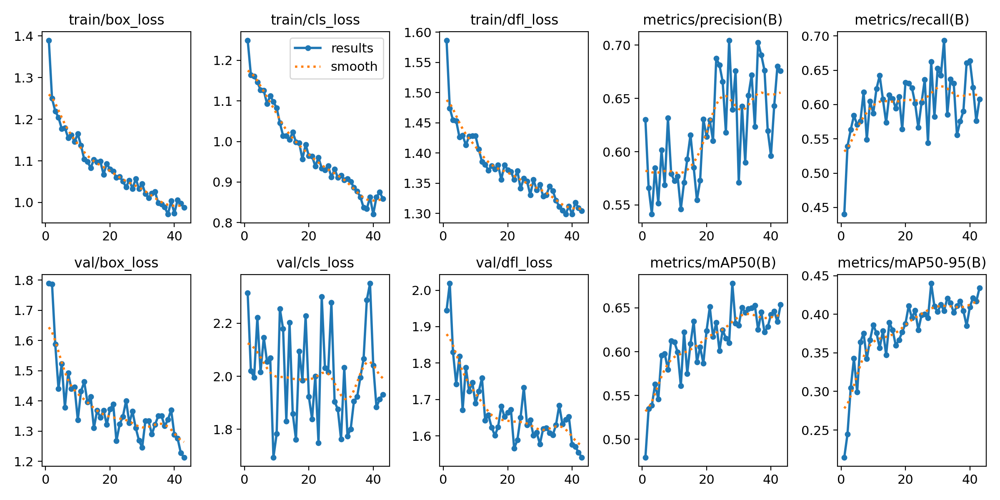
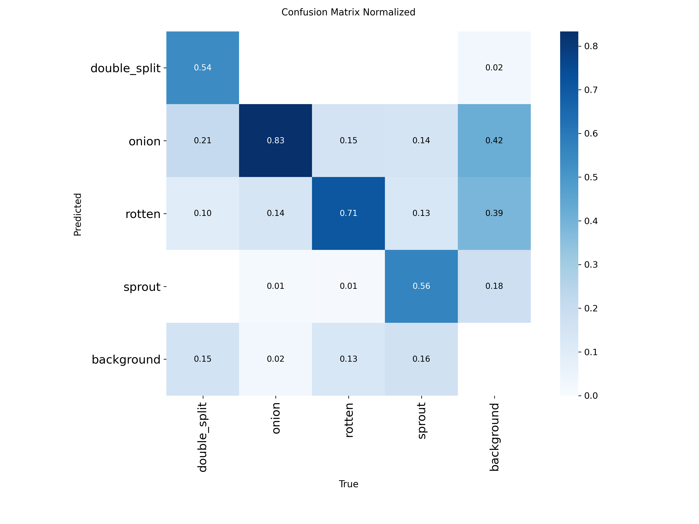
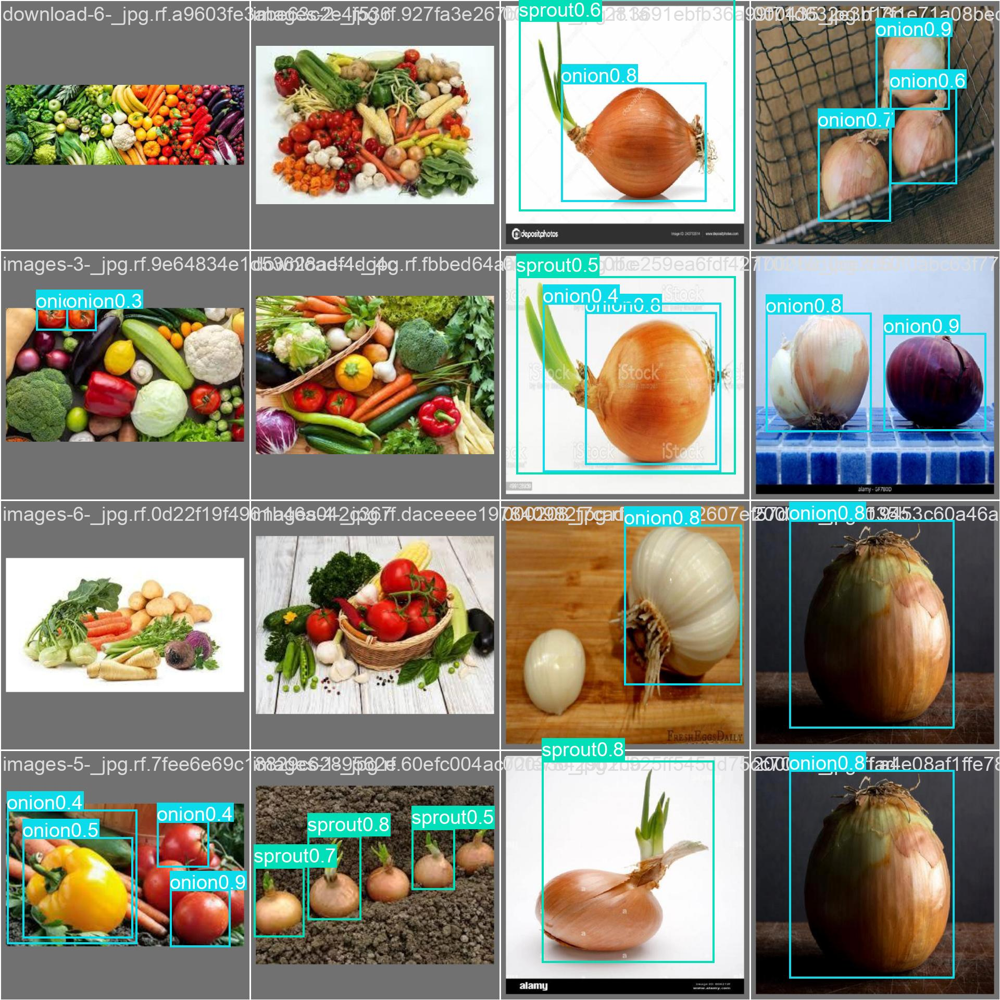
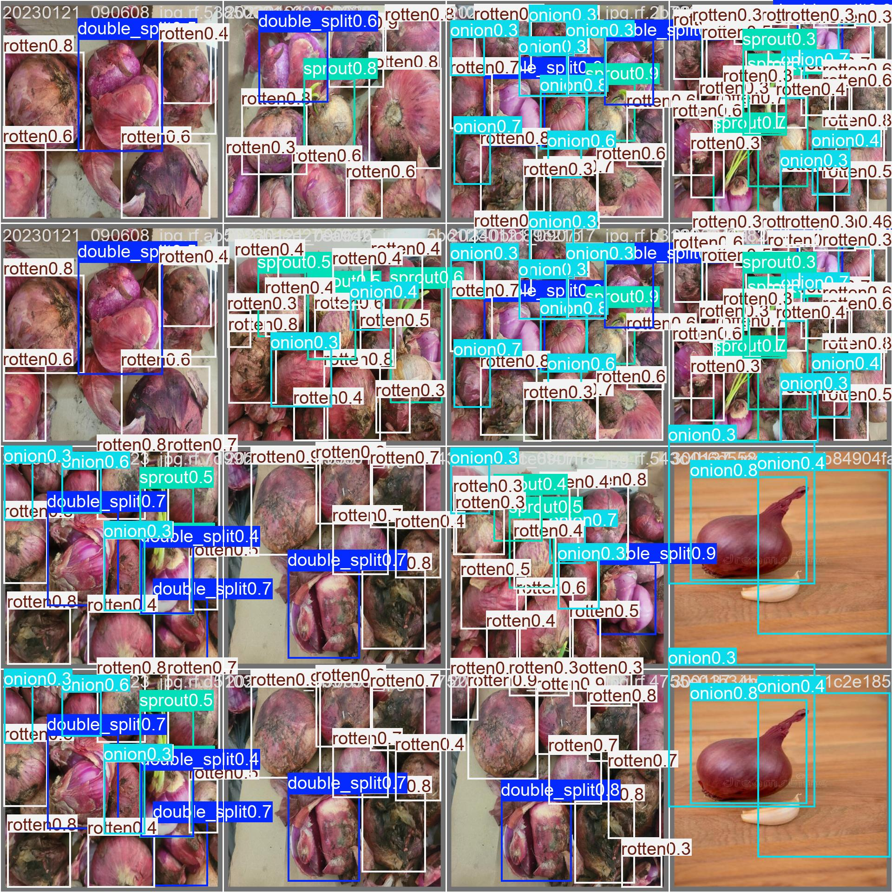

# Onion Precision Model V2 - Training Showcase

This document outlines the training configuration, performance metrics, and validation results of the fine-tuned Onion Quality Assessment YOLO model.

## ⚙️ Training Configuration

The model was fine-tuned using the Ultralytics YOLO framework to detect and classify onion quality, prioritizing precise detection of defects (`rotten`, `sprout`, `double_split`).

| Parameter | Value |
| :--- | :--- |
| **Task** | Detection (`detect`) |
| **Epochs** | 44 (Early stopping triggered, max 100) |
| **Optimizer** | AdamW |
| **Batch Size** | 16 |
| **Image Size (imgsz)** | 640px |
| **Base Weights** | `onion_defect_model/weights/best.pt` |

---

## 📊 Final Performance Metrics

At the final training epoch (Epoch 43), the model achieved the following performance on the validation split:

| Metric | Score |
| :--- | :--- |
| **mAP50 (Mean Average Precision @ 0.50)** | `0.654` |
| **mAP50-95 (Mean Average Precision @ 0.50:0.95)** | `0.434` |
| **Precision** | `0.676` |
| **Recall** | `0.608` |

> [!TIP]
> The mAP50 score of **65.4%** indicates solid performance in correctly isolating healthy onions versus defective ones, especially considering the visual similarity between healthy and slightly damaged crops.

---

## 📈 Training Progress

The training loss consistently decreased while mAP and Precision metrics stabilized, indicating healthy convergence without extreme overfitting before early stopping engaged.

---

## 🎯 Confusion Matrix

The normalized confusion matrix breaks down how accurately the model identifies each specific defect class. High values along the diagonal represent correct classifications.

---

## 👁️ Validation Predictions

Below are samples from the validation set showing the model's actual bounding box predictions and confidence scores.

### Sample Batch 0

### Sample Batch 1

